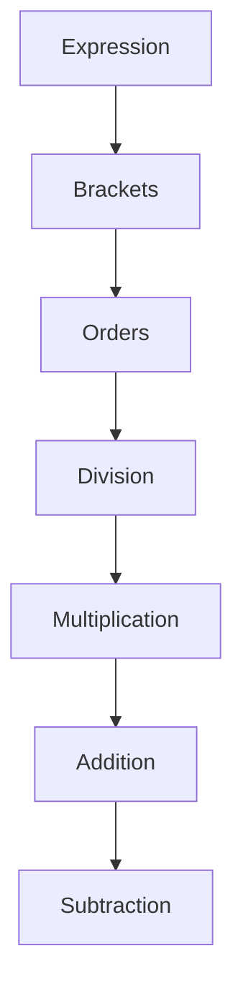
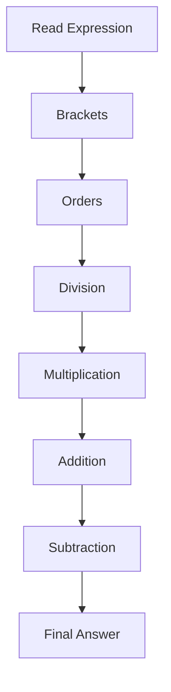

# BODMAS Rule

The **BODMAS Rule** defines the standard order in which mathematical operations are performed when an expression contains more than one operation. Following this order ensures that every person evaluates an expression in the same way and obtains the same answer.

BODMAS is one of the most fundamental topics in Quantitative Aptitude. It is frequently tested in SSC, Banking, Railway, Defence, CAT, Placement Tests, and many other competitive examinations. A strong understanding of BODMAS also forms the foundation for topics such as Simplification, Algebra, Approximation, and Equation Solving.

---

# Core Concept

BODMAS stands for:

| Letter | Meaning |
| --- | --- |
| **B** | Brackets |
| **O** | Orders (Powers and Roots) |
| **D** | Division |
| **M** | Multiplication |
| **A** | Addition |
| **S** | Subtraction |

Whenever an expression contains multiple operations, they should be performed in the above order.

For operations having the same priority, evaluate them **from left to right**.

---

# Order of Operations

---

# Types of Brackets

When different brackets appear together, solve them from the innermost bracket outward.

| Priority | Bracket |
| --- | --- |
| 1 | ( ) Parentheses |
| 2 | { } Curly Braces |
| 3 | [ ] Square Brackets |

---

# Important Rules

## Rule 1: Solve Brackets First

Always evaluate the innermost bracket before performing any other operation.

Example:

$$
15+(6\times3)-9
$$

First,

$$
6\times3=18
$$

Then,

$$
15+18-9=24
$$

---

## Rule 2: Evaluate Powers and Roots

Orders include exponents and roots.

Example:

$$
3^2+4
$$

First,

$$
3^2=9
$$

Then,

$$
9+4=13
$$

---

## Rule 3: Division Before Multiplication?

Division and multiplication have the same priority.

Perform them **from left to right**.

Example:

$$
24\div3\times2
$$

First,

$$
24\div3=8
$$

Then,

$$
8\times2=16
$$

---

## Rule 4: Addition and Subtraction

Addition and subtraction also have equal priority.

Solve them from left to right.

Example:

$$
20-5+8
$$

First,

$$
20-5=15
$$

Then,

$$
15+8=23
$$

---

# Step-by-Step Method

Follow these steps whenever you evaluate an expression.

1. Solve brackets from the innermost level.
2. Evaluate powers and roots.
3. Perform division from left to right.
4. Perform multiplication from left to right.
5. Perform addition from left to right.
6. Perform subtraction from left to right.
7. Verify the final answer.

---

# Solving Process

---

# Standard Question Types

## Type 1: Expression Without Brackets

Example

$$
12+4\times3-6
$$

### Solution

Multiply first.

$$
4\times3=12
$$

Now,

$$
12+12-6=18
$$

**Answer:** 18

---

## Type 2: Expression With Brackets

Example

$$
15+(6\times3)-9
$$

### Solution

Evaluate the bracket.

$$
6\times3=18
$$

Now,

$$
15+18-9=24
$$

**Answer:** 24

---

## Type 3: Nested Brackets

Example

$$
100-[20+\{3\times(5+2)\}]
$$

### Solution

Step 1

$$
5+2=7
$$

Step 2

$$
3\times7=21
$$

Step 3

$$
20+21=41
$$

Step 4

$$
100-41=59
$$

**Answer:** 59

---

## Type 4: Division and Multiplication Together

Example

$$
24\div3+5\times2
$$

### Solution

Division

$$
24\div3=8
$$

Multiplication

$$
5\times2=10
$$

Addition

$$
8+10=18
$$

**Answer:** 18

---

# Competitive Exam Tricks

- Never solve expressions from left to right without considering operator priority.
- Division and multiplication have equal priority.
- Addition and subtraction have equal priority.
- Always solve the innermost bracket first.
- Rewrite long expressions after every operation to reduce mistakes.

---

# Common Mistakes

| Mistake | Correct Approach |
| --- | --- |
| Performing addition before multiplication | Multiply first |
| Ignoring brackets | Always solve brackets first |
| Solving multiplication before division regardless of position | Follow left-to-right rule |
| Solving subtraction before addition | Follow left-to-right rule |
| Skipping intermediate steps | Rewrite the expression after every operation |

---

# Practical Examples

### Example 1

Evaluate

$$
50-5\times4+10
$$

Solution

$$
5\times4=20
$$

$$
50-20+10=40
$$

**Answer:** 40

---

### Example 2

Evaluate

$$
18\times3\div9+4-2
$$

Solution

$$
18\times3=54
$$

$$
54\div9=6
$$

$$
6+4-2=8
$$

**Answer:** 8

---

### Example 3

Evaluate

$$
84\div[4+3\times(5-2)]
$$

Solution

$$
5-2=3
$$

$$
3\times3=9
$$

$$
4+9=13
$$

$$
84\div13
$$

**Answer:** \(\frac{84}{13}\)

---

# Exam Tips

- Read the complete expression before starting calculations.
- Never skip brackets.
- Perform only one operation at a time.
- Rewrite the remaining expression after every step.
- In competitive exams, most BODMAS mistakes occur because multiplication or division is ignored.

---

# Summary

- BODMAS defines the correct order of mathematical operations.
- Always solve brackets before other operations.
- Evaluate powers and roots after brackets.
- Division and multiplication are performed from left to right.
- Addition and subtraction are also performed from left to right.
- Following BODMAS ensures every mathematical expression has one unique and correct answer.

