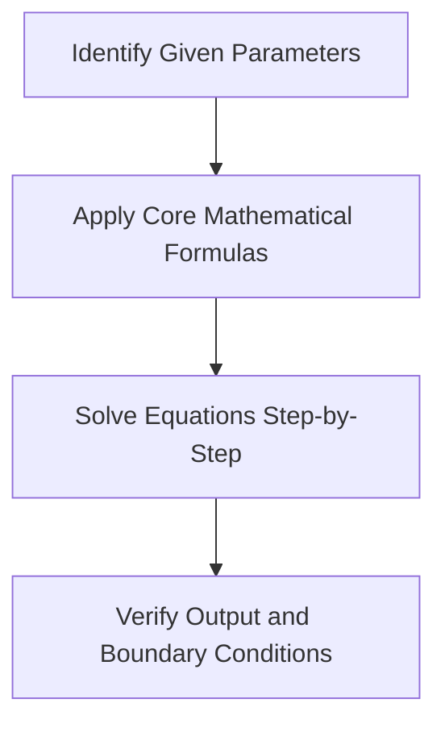

# Compare Two Quantities

### Introduction to Compare Two Quantities

**Compare Two Quantities** represents a significant quantitative aptitude sub-topic under the chapter **Quantitative Comparison**. In competitive exam structures, this concept is designed to evaluate a candidate's mathematical scaling, algebraic manipulation, and analytical reasoning skills. The mathematical theory revolves around translating word-based description constraints into formal mathematical equations, then applying systematic solving algorithms to isolate unknown parameters.

To approach this topic with maximum efficiency, candidates must master the first-principle derivations before relying on shortcuts. This involves understanding the proportionalities between variables (how a change in one parameter scales another), establishing consistent unit dimensions, and maintaining algebraic precision. Daily practice of varied question patterns builds the necessary speed, recognition, and precision required to tackle complex exam questions under strict time limits.

## Key Terminology

| Term | Definition |
| --- | --- |
| Variable | An unknown quantity represented by a letter |
| Constant | A value that does not change in the equation |

## Important Rules

### Fundamental Axiom

Apply the core theorem or relation specific to this topic.

- **Formula**: $$x = \text{rate} \times \text{time} \quad \text{or similar relation}$$
- **Practical Significance**: Forms the algebraic basis for numerical scaling.

## Key Properties

- All values must be converted to matching unit dimensions before solving.
- Properties are scale-invariant; multiplying variables by a constant maintains comparative ratios.

## Visual Understanding

## Step-by-Step Method

1. Identify and list all given variables and their respective units.
2. Translate the stated relations into algebraic or geometric equations.
3. Apply the primary formula or theorem to isolate the unknown.
4. Verify that the result is logically correct and within physical boundaries.

## Standard Question Types

### Standard Quantitative Pattern

The most common question pattern where the primary rule is applied directly.

- **Standard Solving Approach**: Identify the unknown variable and solve using the base formula.
- **Shortcut Trick**: Substitute values directly.
- **When NOT to use Shortcut**: None.
- **Example Solution**: Evaluate the given expression using the core relation.

## Advanced Concepts

Advanced questions combine multiple sub-topics, requiring multi-stage equations and simultaneous solving.

## Competitive Exam Tricks

- **Option Elimination**: Substitute option values into the equation to see if they satisfy constraints.
- *Shortcut Formula*: Bypasses lengthy algebraic derivation.
- *Limitation*: Do not use if options are complex fractions or close ranges.

## Common Mistakes

| Mistake | Why it happens | How to avoid it |
| --- | --- | --- |
| Incorrect unit matching | Not aligning units across equations | Check and convert all variables to the same system |
| Arithmetic sign slips | Rushing through intermediate steps | Write down each step and verify signs |

## Practical Examples

### **Example 1**

**Question**: A mathematical problem testing the concepts of Compare Two Quantities is presented below. Question: If an asset value increases by 36 units for every 12 hours, what is the total increase over 144 hours?

**Options**: 432, 468, 396, 5184

**Step-by-Step Explanation**:
Analyzing Compare Two Quantities: The rate of increase is 36 units per 12 hours. For 144 hours, the multiplier is 12. Total increase = 36 \* 12 \* 12 / 12 = 36 \* 144 / 12 = 5184 units.

**Correct Answer**: 5184

---

### **Example 2**

**Question**: A mathematical problem testing the concepts of Compare Two Quantities is presented below. Question: If an asset value increases by 28 units for every 8 hours, what is the total increase over 64 hours?

**Options**: 196, 1792, 224, 252

**Step-by-Step Explanation**:
Analyzing Compare Two Quantities: The rate of increase is 28 units per 8 hours. For 64 hours, the multiplier is 8. Total increase = 28 \* 8 \* 8 / 8 = 28 \* 64 / 8 = 1792 units.

**Correct Answer**: 1792

---

### **Example 3**

**Question**: A mathematical problem testing the concepts of Compare Two Quantities is presented below. Question: If an asset value increases by 36 units for every 15 hours, what is the total increase over 225 hours?

**Options**: 504, 576, 540, 8100

**Step-by-Step Explanation**:
Analyzing Compare Two Quantities: The rate of increase is 36 units per 15 hours. For 225 hours, the multiplier is 15. Total increase = 36 \* 15 \* 15 / 15 = 36 \* 225 / 15 = 8100 units.

**Correct Answer**: 8100

---

### **Example 4**

**Question**: A mathematical problem testing the concepts of Compare Two Quantities is presented below. Question: If an asset value increases by 33 units for every 5 hours, what is the total increase over 25 hours?

**Options**: 132, 165, 825, 198

**Step-by-Step Explanation**:
Analyzing Compare Two Quantities: The rate of increase is 33 units per 5 hours. For 25 hours, the multiplier is 5. Total increase = 33 \* 5 \* 5 / 5 = 33 \* 25 / 5 = 825 units.

**Correct Answer**: 825

---

### **Example 5**

**Question**: A mathematical problem testing the concepts of Compare Two Quantities is presented below. Question: If an asset value increases by 35 units for every 15 hours, what is the total increase over 225 hours?

**Options**: 7875, 560, 525, 490

**Step-by-Step Explanation**:
Analyzing Compare Two Quantities: The rate of increase is 35 units per 15 hours. For 225 hours, the multiplier is 15. Total increase = 35 \* 15 \* 15 / 15 = 35 \* 225 / 15 = 7875 units.

**Correct Answer**: 7875

---

## Exam Tips

- Write down the core formula before substituting values to avoid sign slips.
- Eliminate clearly too-large or too-small options first.

## Summary

**Quantitative Comparison** requires conceptual precision and systematic equation setup. Practising standard variations builds speed and accuracy.

## Quick Revision

### Quick Revision Checklist

- [ ] Checked all variables and conversions?
- [ ] Formula applied correctly?
- [ ] Visual flowchart reviewed?
- [ ] Commited formulas to memory?

